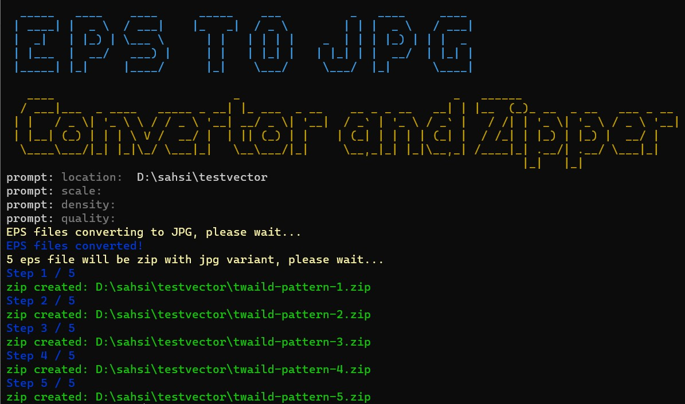
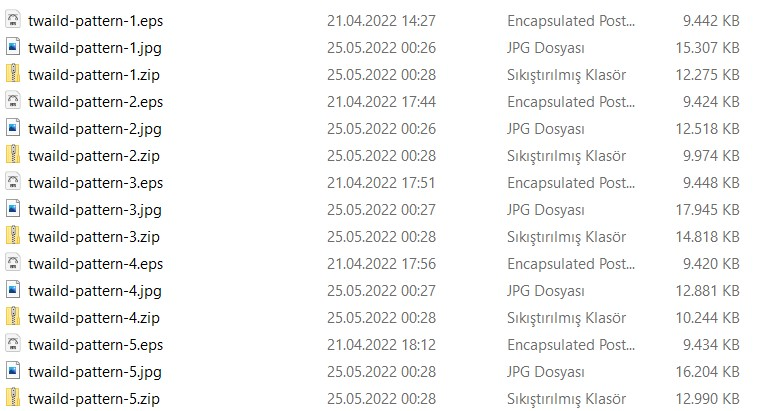
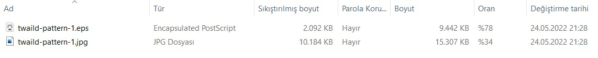

# EPS2JPG Convertor And Zipper
This is simple project use ImageMagick and Ghostscript to generate jpg files from eps. After generation script will zip generated jpg file with orginal eps file. It is useful for submit files to stock agent like depositphoto which need zip upload.

- [EPS2JPG Convertor And Zipper](#eps2jpg-convertor-and-zipper)
  - [Requirements](#requirements)
  - [Installation](#installation)
  - [Usage](#usage)
    - [Result Example](#result-example)
    - [Zip Detail](#zip-detail)
  - [Params](#params)

> Attention! mogrify can change original files. For this reason if you customize this project be careful when writing command.  [Read doc about mogrify](https://imagemagick.org/script/mogrify.php)

## Requirements

- Nodejs > 14
- ImageMagick
- Ghostscript

## Installation

```powershell
git clone https://github.com/pikselinweb/eps2jpg-converter-for-stock-photo.git
cd eps2jpg-converter-for-stock-photo
npm install
```
> Don't forget to install requirements. ImageMagick and Ghostscript CLI Tools are required.

## Usage

```powershell
npm start
```
It is all! You need to enter location of folder that eps files stored. Other params are optional.



> Be careful! Location params must be like your os format. For example in cmder when i paste location it turns to `/d/sahsi/testvector` in Windows. As you see in the Screenshoot original location is `D:\sahsi\testvector`, i must use Microsoft Terminal for working correctly.

> Depends your system eps to jpg convertion may take a time. If you get error try to separate files. In other section check if ImageMagick and Ghostscript working correctly in your machine and having rw permission.

### Result Example



### Zip Detail



## Params

|Param|Required|Type|Description|
|-|-|-|-|
|__location__|yes|string|Paste eps folder location|
|__resize__|no|number|It will resize photo by percent. I use it to reduce size of generated image. Default value is 85|
|__density__|no|number|Default value is 300|
|__quality__|no|number|JPG Quality, default value is 100|
